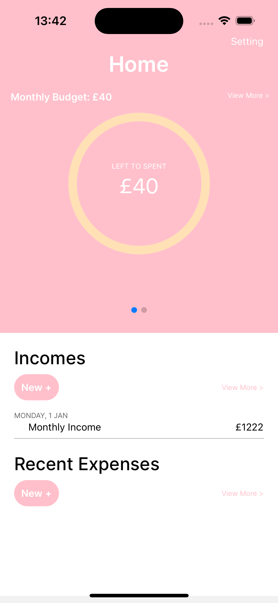
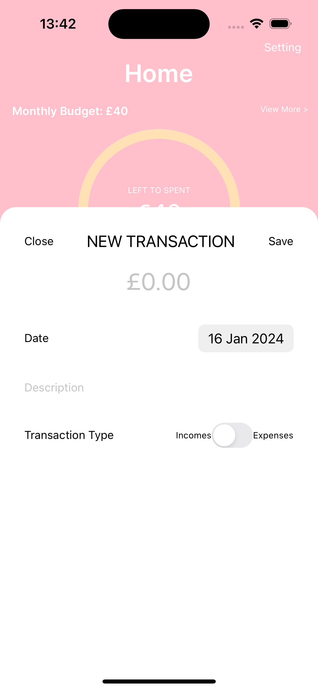
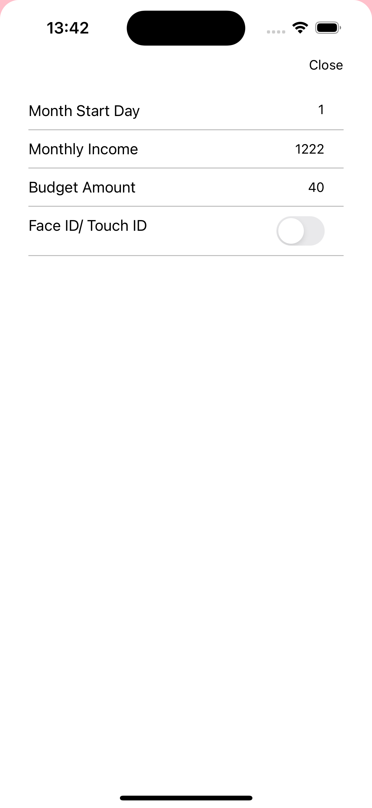

# Budget Me

Welcome to Budget Me, your personal budgeting app built with Expo and React Native.

## Table of Contents

- [Introduction](#introduction)
- [Getting Started](#getting-started)
  - [Prerequisites](#prerequisites)
  - [Installation](#installation)
- [Usage](#usage)
- [Features](#features)
- [Contributing](#contributing)
- [License](#license)

## Introduction

Budget Me is a mobile app designed to help users manage their finances efficiently. Track your income, expenses, and budget to achieve your financial goals.

## Getting Started

### Prerequisites

Make sure you have the following tools installed:

- [Node.js](https://nodejs.org/) and npm
- [Expo CLI](https://docs.expo.dev/get-started/installation/)
- [Git](https://git-scm.com/)

### Installation

1. Clone the repository:
```
git clone https://github.com/your-username/budget-me.git
```

2. Navigate to the project directory:
```
cd budget-me
```

3. Install dependencies:   
```
npm install
```
 
## Usage

1. Start the Expo development server:
```
npm run start
```

2. Use the Expo Go app on your mobile device or an emulator to scan the QR code and preview the app.

## Features

Track income and expenses

Set monthly budget goals

Visualize spending patterns with charts

Secure your data with Touch ID/Face ID

## Screenshots






## Contributing

We welcome contributions! If you'd like to contribute to Budget Me, follow these steps:

1. Fork the project.

2. Create a new branch: git checkout -b feature/your-feature-name

3. Commit your changes: git commit -m 'Add some feature'

4. Push to the branch: git push origin feature/your-feature-name

5. Open a pull request.

## License

This project is licensed under the MIT License.
